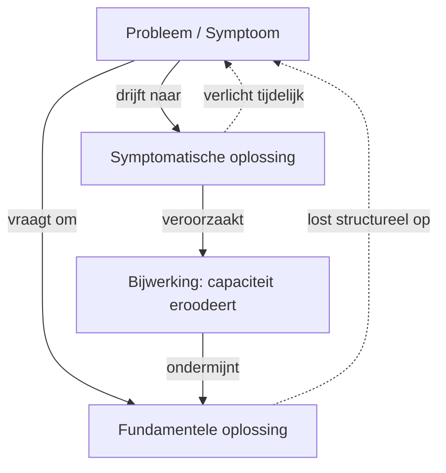
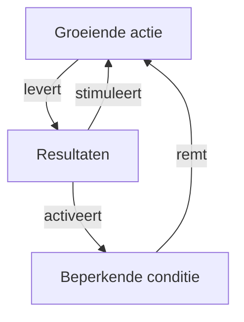
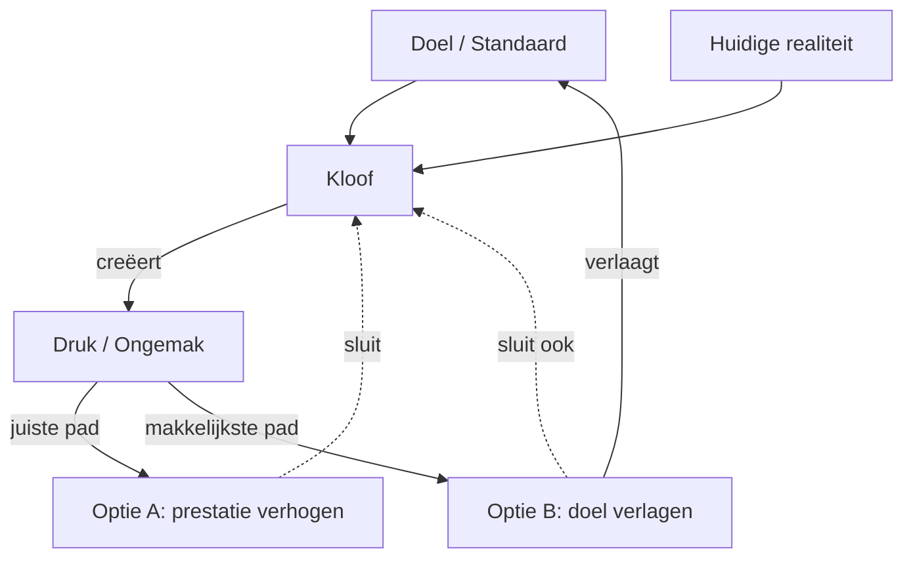
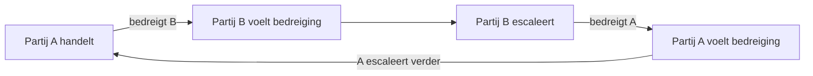
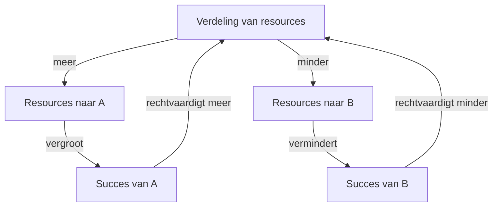
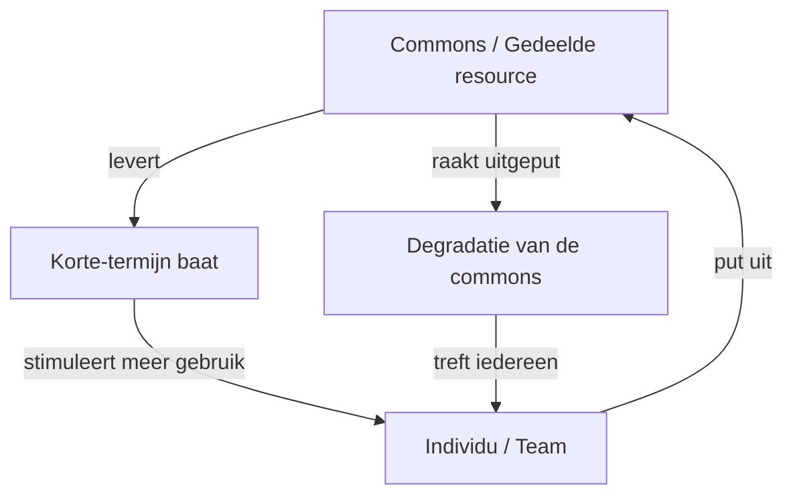
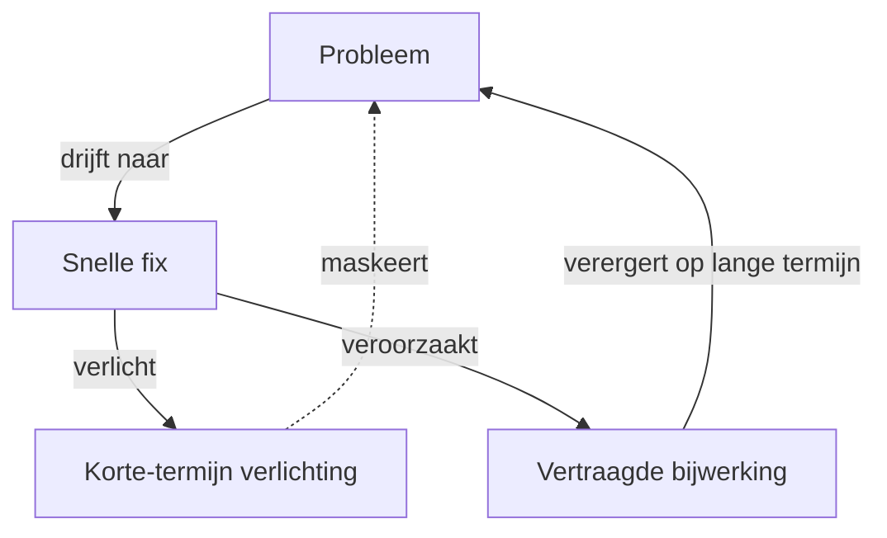
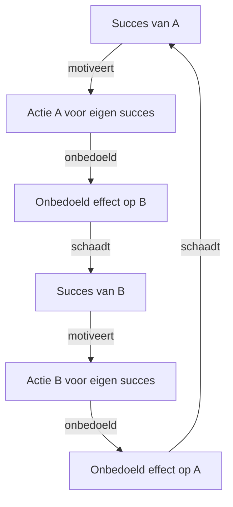

## Core idea

Learning organizations master five disciplines: systems thinking, personal mastery, mental models, shared vision, and team learning. Without continuous learning, organizations cannot adapt to complexity.

## Key concepts

[Learning Organization](../concepts/learning-organization.md), [Systems Thinking](../concepts/systems-thinking.md), [Mental Models](../concepts/mental-models.md), [[shared-vision]], [[personal-mastery]], [[team-learning]], [[system-archetypes]]

## What I took from it

### General

*(To be filled in)*

### Connection to our work

AI-first transformation requires organizational learning capability — not just technical implementation. The sensing cadence IS a learning loop. Mental models are what change first and last. Related: [Thinking In Systems: A Primer](meadows-thinking-in-systems-a-primer.md), [Cynefin Framework](snowden-cynefin.md), [Reinventing organizations: geillustreerde versie (Dutch Edition)](laloux-reinventing-organizations-geillustreerde-versie-dutch-editio.md)

---

## Summary

### Centrale stelling

Een **lerende organisatie** is een organisatie die continu haar capaciteit vergroot om haar eigen toekomst te creëren. Zonder dit vermogen kunnen organisaties niet omgaan met toenemende complexiteit. De vijf disciplines zijn de bouwstenen van zo'n organisatie — maar ze werken alleen samen, niet afzonderlijk.

---

### De vijf disciplines

#### 1. Personal Mastery
Individuen werken voortdurend aan hun eigen groei en leren. Kernidee: de **creatieve spanning** tussen de huidige realiteit en de gewenste toekomst. Wie die spanning verdraagt zonder te vluchten naar cynisme of valse hoop, groeit. Wie de spanning wegneemt door de lat te verlagen, stagneert.

#### 2. Mental Models
Diepgewortelde aannames en overtuigingen die bepalen hoe we de wereld zien — en dus hoe we handelen. Ze zijn zelden expliciet maar altijd aanwezig. De discipline bestaat uit het **bewust oppervlak brengen en uitdagen** van die modellen, zowel individueel als organisatorisch. Niet blootstellen = ze regeren onzichtbaar.

#### 3. Shared Vision
Niet een visieverklaring die van bovenaf opgelegd wordt, maar een **gedeelde aspiratie die oprecht gedeeld wordt** door de mensen in de organisatie — en die ontstaat vanuit persoonlijke visies. Echte shared vision mobiliseert, opgelegde vision wekt weerstand of schouderophalen. Het verschil zit in commitment vs. compliance.

#### 4. Team Learning
Start met het onderscheid tussen **dialoog** en **discussie**:
- **Dialoog**: aannames opschorten, samen denken, verkennen — het team denkt als geheel
- **Discussie**: posities verdedigen, overtuigen — nuttig voor beslissingen, maar blokkeert leren als het de enige modus is

Teams kunnen collectief intelligenter zijn dan de som van hun leden — maar ook collectief dommer. Defensieve routines (onuitgesproken afspraken om moeilijke onderwerpen te vermijden) zijn de voornaamste rem.

#### 5. Systems Thinking — de vijfde discipline
De integratiediscipline die alle andere samenbindt. Kernidee: de wereld bestaat niet uit lineaire oorzaak-gevolg ketens, maar uit **feedback loops, vertragingen en niet-lineaire verbanden**. Wie alleen lineair denkt, lost problemen op door nieuwe problemen te creëren.

Twee fundamentele looptypes:
- **Versterkende loop (reinforcing)**: groei of verval versnelt zichzelf — kleine oorzaken, grote gevolgen
- **Balancerende loop (balancing)**: systeem streeft naar evenwicht, corrigeert afwijkingen — vaak onzichtbaar als weerstand tegen verandering

**Vertragingen** zijn de meest onderschatte factor: oorzaak en gevolg zijn zelden dicht bij elkaar in tijd en ruimte. Dit maakt systemen moeilijk te begrijpen en leidt tot over-correctie.

---

### Systeem-archetypen

Terugkerende patronen van disfunctioneel organisatiegedrag — herkenbaar, maar zelden benoemd:

| Archetype | Kernpatroon |
|---|---|
| **Shifting the Burden** | Symptomatische oplossing verlicht het probleem maar ondermijnt de fundamentele oplossing; afhankelijkheid groeit |
| **Limits to Growth** | Een versterkende loop stuit op een balancerende rem die genegeerd wordt; groei stopt of keert om |
| **Eroding Goals** | Onder druk worden doelen verlaagd i.p.v. inspanning verhoogd; standaard daalt geleidelijk |
| **Escalation** | Twee partijen reageren op elkaars acties met tegenmaatregelen; spiraal omhoog |
| **Success to the Successful** | Winnaar krijgt meer middelen → wint nog meer; verliezer wordt uitgekleed |
| **Tragedy of the Commons** | Gedeelde resource wordt uitgeput omdat niemand individueel belang heeft bij onderhoud |
| **Fixes that Fail** | Snelle oplossing heeft vertraagde bijwerkingen die het oorspronkelijke probleem verergeren |
| **Accidental Adversaries** | Twee partijen ondermijnen elkaars succes onbedoeld via bijwerkingen van eigen acties |

---

### De elf wetten van de vijfde discipline

Senge formuleert elf inzichten die ingaan tegen onze intuïtie:

1. De problemen van vandaag komen van de oplossingen van gisteren
2. Hoe harder je duwt, hoe harder het systeem terugduwt
3. Gedrag verbetert voor het verslechtert *(symptomatische oplossingen maskeren de diepere oorzaak)*
4. De gemakkelijkste uitweg leidt meestal terug naar binnen
5. Het medicijn kan erger zijn dan de ziekte
6. Sneller is langzamer
7. Oorzaak en gevolg liggen niet dicht bij elkaar in tijd en ruimte
8. Kleine veranderingen kunnen grote resultaten geven — maar de hefboomgebieden zijn zelden voor de hand liggend
9. Je kan én winnen én verliezen — maar niet tegelijk
10. Een olifant in twee delen snijden levert geen twee kleine olifanten op *(systemen zijn niet optelbaar)*
11. Er is niemand om de schuld op te gooien

---

### Het Beer Game

Een simulatie die aantoont hoe rationeel handelende individuen — elk voor zich — een systeem in chaos brengen zonder dat iemand dat wil of veroorzaakt. De les: **systemische krachten**, niet slechte mensen, veroorzaken de meeste organisatieproblemen. Schuld toewijzen is zinloos; de structuur begrijpen is de enige uitweg.

---

### Kernspanning van het boek

> Organisaties zijn ontworpen voor beheersing, niet voor leren.  
> Lerende organisaties vereisen een fundamenteel andere mindset: van beheersen naar navigeren, van antwoorden naar vragen, van zekerheid naar nieuwsgierigheid.

De vijf disciplines zijn geen technieken — ze zijn een **levenshouding** die de hele manier van werken doordringt.

---

## Systeem-archetypen — diagrammen

### Legende

| Notatie | Betekenis |
|---|---|
| `A -->|"..."| B` | A veroorzaakt B direct |
| `A -.->|"..."| B` | A beïnvloedt B via feedback of vertraging |
| Versterkende loop | Twee nodes versterken elkaar wederzijds → groei of verval |
| Balancerende loop | Een node remt een andere → systeem zoekt evenwicht |

---

### Shifting the Burden

---

### Limits to Growth

---

### Eroding Goals

---

### Escalation

---

### Success to the Successful

---

### Tragedy of the Commons

---

### Fixes that Fail

---

### Accidental Adversaries

