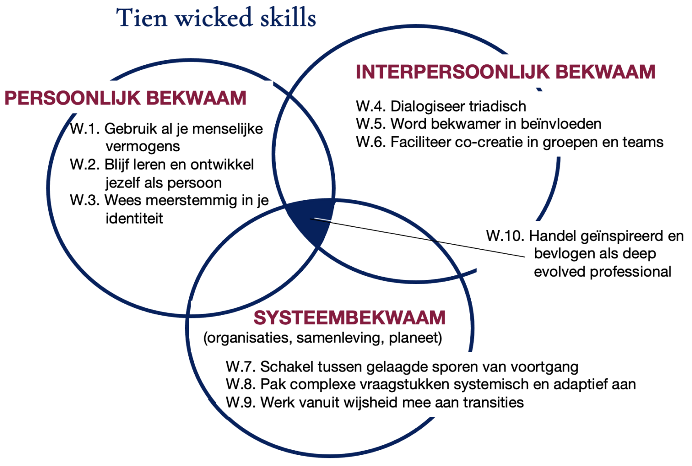

## Core idea

Professionals in complexe, veranderende omgevingen hebben een specifieke set van vaardigheden nodig die verder gaan dan technische expertise. Vandamme noemt ze **wicked skills** — tien generieke competenties en de bijhorende mindset om richting te houden wanneer situaties weerstand oproepen, geen eenduidig antwoord hebben, en persoonlijk engagement vragen. Het boek sluit zijn *Deep Evolvement*-reeks af.

## Key concepts

[[wicked-problems]], [[plek-der-moeite]], [[meerstemmige-identiteit]], [Trialoog](../concepts/trialoog.md), [[holarchie]], [[emergence]], [[lifelong-learning]], [[bevlogenheid]], [Complexity](../concepts/complexity.md)

## What I took from it

### General

Vandamme is psycholoog, filosoof, antropoloog en master NLP-trainer. Hij combineert inzichten uit filosofie, psychologie en systeemdenken en koppelt die aan de praktijk van professionals en leidinggevenden. *Wicked Skills* is theoretisch sterk onderbouwd én praktisch toepasbaar — een combinatie die in de vakliteratuur niet vanzelfsprekend is.

Het sleutelconcept is de **Plek der Moeite**: elk lastig moment in je leven en werk waarin je kiest om je geweten te volgen en het hoogst menselijke als leidraad te nemen. Dat is niet de plek van gemak of routine — het is precies de plek waar groei en transformatie zich aandienen, als je bereid bent er te blijven.

### Connection to our work

**Wicked problems als professioneel kader.** Vandamme bouwt voort op [Rittel & Webber](https://en.wikipedia.org/wiki/Wicked_problem)'s concept van *wicked problems* — vraagstukken zonder eenduidige oplossing, waarbij elke interventie nieuwe problemen creëert. Dit is het dagelijkse landschap van AI-adoptie en organisatieverandering. De tien skills zijn een antwoord op de vraag: hoe werk je professioneel in dat landschap zonder je te verliezen in technische oplossingen voor fundamenteel menselijke vraagstukken.

**Meerstemmige identiteit als voorwaarde.** Vandamme stelt dat effectieve professionals niet één rol innemen maar meerdere perspectieven tegelijk kunnen vasthouden. Dit sluit direct aan bij [Galinsky's perspectiefname-onderzoek](../articles/galinsky-power-and-perspectives-not-taken.md): de vaardigheid om andermans standpunt in te nemen is niet vanzelfsprekend, maar leerbaar — en noodzakelijk.

**[Trialoog](../concepts/trialoog.md) als samenwerkingspatroon.** Waar klassieke dialoog twee stemmen heeft die naar consensus zoeken, voegt de trialoog een derde perspectief toe dat het gesprek openhoudt. Dit is een directe tegenhanger van de besloten AI-feedbackloops die [Véliz](veliz-prophecy-prediction-power-and-the-fight-for-the-future.md) en [O'Neil](oneil-weapons-of-math-destruction.md) beschrijven: systemen die zichzelf bevestigen. De trialoog als basispatroon is een structureel tegengif.

Related: [De Corporate Activist: Het transitiecanvas als leidraad](vandamme-de-corporate-activist.md), [Power and Perspectives Not Taken](../articles/galinsky-power-and-perspectives-not-taken.md), [The Fifth Discipline: The Art & Practice of The Learning Organization](senge-the-fifth-discipline-the-art-practice-of-the-learning-organi.md), [Thinking In Systems: A Primer](meadows-thinking-in-systems-a-primer.md)

---

## Samenvatting

### De centrale metafoor: de Plek der Moeite

> De Plek der Moeite is elk lastig moment in je leven en werk waarin je kiest om je geweten te volgen en het hoogst menselijke als leidraad te nemen van je handelen.

Dit is geen romantisering van moeilijkheid — het is een [epistemologisch](https://nl.wikipedia.org/wiki/Kennistheorie) standpunt: groei, leren en betekenisvol werk ontstaan niet in comfort maar in wrijving. De professional die de Plek der Moeite vermijdt via technische oplossingen, procedures of delegatie, verliest precies de capaciteit die complexe vraagstukken vragen.

---

### Technische problemen vs. wicked problems

Vandamme bouwt op de klassieke onderscheiding van [Rittel & Webber (1973)](https://en.wikipedia.org/wiki/Wicked_problem):

| | Technisch probleem | Wicked problem |
|---|---|---|
| Definitie | Helder, afgebakend | Afhankelijk van perspectief |
| Oplossing | Juist of fout | Beter of slechter |
| Aanpak | Expertise toepassen | Oordelen, waarden, dialoog |
| Voorbeelden | Software debuggen, brug bouwen | Organisatieverandering, AI-adoptie, leiderschap |

De wicked skills zijn de competenties die je nodig hebt voor de rechterkolom — en die in klassieke opleidingen en managementliteratuur systematisch onderbelicht worden.

---

### De vier delen en tien skills

**Deel 1 — Persoonlijke ontwikkeling**

**1. Levenslang leren en ontwikkelen (Bildung)**
Niet alleen kennis en vaardigheden bijhouden, maar *Bildung* — persoonlijke vorming en cultuurontwikkeling als continu proces. Leren is niet instrumenteel (voor een doel) maar constitutief (je wordt erdoor).

**2. Meerstemmige professionele identiteit**
Je vakrollen zodanig positioneren dat je *meerdere perspectieven en dimensies* van jezelf kunt inzetten. Niet één vaste rol, maar een rijke, flexibele identiteit die situationeel ingezet kan worden.

---

**Deel 2 — Interpersoonlijke vaardigheden**

**3. [Trialoog](../concepts/trialoog.md) als samenwerkingspatroon**
De trialoog — triadisch dialogiseren — als basispatroon van samenwerking. Twee partijen plus een derde perspectief dat het gesprek openhoudt en verdiept. Tegenover de klassieke dialoog die naar consensus zoekt, houdt de trialoog de complexiteit levend.

**4. Meesterschap in beïnvloeding en gedragsverandering**
Niet manipuleren, maar verbinden. Invloed uitoefenen via *vertrouwen en psychologische veiligheid* in plaats van hiërarchische controle of technische overtuiging.

**5. Co-creatief omgaan met diversiteit**
Verschillen binnen groepen en teams valoriseren terwijl je gezamenlijke doelen nastreeft. *Diversiteit als creatieve kracht*, niet als probleem dat gemanaged moet worden.

---

**Deel 3 — Systeemperspectief**

**6. Positioneren in gehelen en schakelen tussen gelaagde voortgangssporen**
Kunnen bewegen tussen niveaus van complexiteit — van individueel naar team naar organisatie naar systeem. *Inzien waar je zit in het grotere geheel en bewust schakelen*.

**7. Wicked problems systematisch en adaptief aanpakken**
Complexe vraagstukken benaderen met aandacht voor *emergentie en holarchie* — de eigenschap dat het geheel meer is dan de som van de delen, en dat elk deel zelf ook een geheel is. Holarchie is de tegenhanger van [reductionisme](https://en.wikipedia.org/wiki/Reductionism): waar reductionisme een heel systeem begrijpt door het begrijpen van de afzonderlijke delen, erkent holarchie dat het begrip van het geheel niet herleidbaar is tot het begrip van enkel die delen. Dit is de kern van wat [Snowden (Cynefin)](./snowden-cynefin.md) en [Appelo (Management 3.0)](./appelo-management-30-leading-agile-developers-developing-agile-lead.md) bedoelen wanneer ze waarschuwen dat reductionistisch denken in het complexe domein structureel faalt.

**8. Bijdragen vanuit wijsheid bij transities**
Paradoxen hanteren, moreel verantwoord handelen, en bijdragen vanuit een bredere wijsheid dan louter vakinhoud of methodiek.

---

**Deel 4 — Integratie**

**9. Gelaagde leerontwikkeling**
Structureel schakelen tussen verschillende niveaus van leren en reflectie — niet alleen doen, maar ook reflecteren op het doen, en reflecteren op de reflectie.

**10. Bevlogen professioneel handelen**
Met inspiratie en zin van betekenis je professionele rol invullen. Bevlogenheid niet als gevoel dat je hebt of niet hebt, maar als vaardigheid die je cultiveert via verbinding met je waarden en je werk.

---

### Sleutelconcepten uitgelicht

**Jobcrafting**
Werk ontwerpen in lijn met persoonlijke waarden en talenten — niet wachten tot de organisatie dat voor je doet, maar actief de grenzen en invulling van je rol vormgeven.

**Weerstand herkaderen**
Weerstand is geen obstructie maar *psychologische stabiliteit* — het systeem beschermt wat het waardevol vindt. De professional die dit begrijpt, werkt mét de weerstand in plaats van ertegen.

**Holarchie**
Elk systeem is tegelijk een deel van een groter geheel én zelf een geheel met eigen dynamiek. Effectief werken in complexe organisaties vereist dat je op meerdere niveaus tegelijk kunt denken en handelen.

---

## Bronnen

- [Managementboek.nl — boekpagina](https://www.managementboek.nl/boek/9789490384364/wicked-skills-rudy-vandamme)
- [Managementboek.nl — recensie](https://www.managementboek.nl/magazine/recensie/22067/wicked-skills--theoretisch-sterk-en-praktisch-toepasbaar)
- [Deep Evolvement — tien Wicked Skills](https://deepevolvement.com/wicked-skills-lab/)
- [rudyvandamme.net — auteurspagina](https://rudyvandamme.net/aanbod/)
